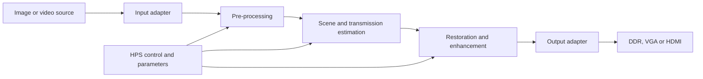

# Kiến trúc dự kiến

Đây là kiến trúc mục tiêu, chưa phải implementation hiện có. Lõi thuật toán trình bày interface streaming nhỏ; các chi tiết board, bus và DDR được giữ trong adapter bên ngoài seam này.

## Phân chia trách nhiệm

- `model/`: thuật toán tham chiếu và khám phá số học.
- `rtl/chisel/`: proof-of-concept Chisel hiện có.
- `rtl/systemverilog/`: vị trí cho RTL SystemVerilog nếu được chọn.
- `verification/`: checker qua interface của lõi.
- `fpga/boards/de1_soc/`: clock, pin, Platform Designer và top-level board.
