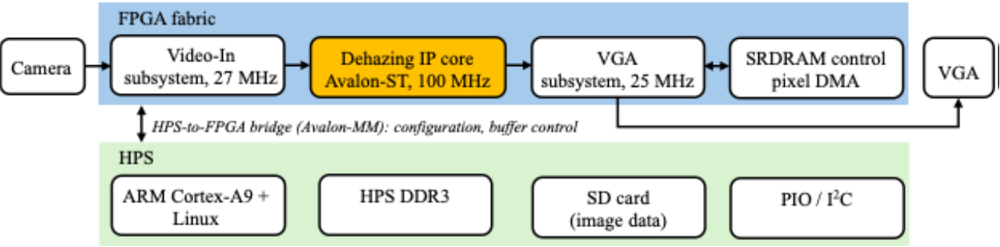
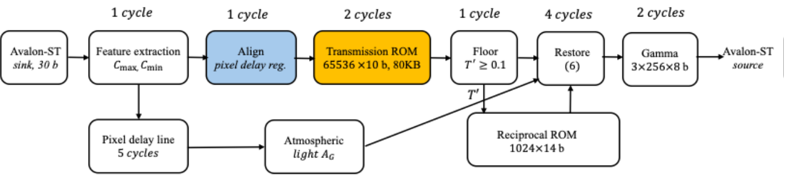
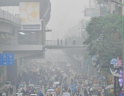
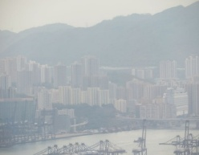
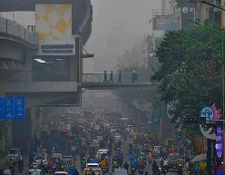

# A Real-Time FPGA-Based Vision Enhancement System

Duy K. Cao1 and Kien T. Truong2

Faculty of Physics and Engineering Physics, University of Science (HCMUS),

Vietnam National University-Ho Chi Minh City, Ho Chi Minh City, Vietnam\
[122130040@student.hcmus.edu.vn](mailto:122130040@student.hcmus.edu.vn), 2truongkien@hcmus.edu.vn

Abstract. Camera-acquired images are often degraded by haze, dust, and fog, compromising computer vision in autonomous driving, surveillance, and IoT applications. This paper presents the design, RTL verification, and on-board demonstration of a vision enhancement system on the Intel Cyclone V DE1-SoC, partitioning work between the ARM Cortex-A9 Hard Processor System and the FPGA fabric. The Verilog pipeline streams one pixel per clock at 11 cycles of latency, which is 6.14ms per 480p frame at 50MHz, 3.07ms at 100MHz under continuous streaming; the still-image path has been verified on the board, with continuous camera-to-display streaming as the next step. Transmission is estimated by a min-channel term modulated by the normalized Saturation and Value channels, suppressing halo artefacts without a spatial refinement filter. A 1×1 dark channel is algebraically identical to V(1−S), so the estimator collapses onto a single 65,536×10-bit look-up table (80KB), with a reciprocal table closing the scattering-model inversion and leaving no divider in the data-path. Post-fit analysis reports 20% ALM and 27% block-memory use with timing closed at 100 MHz across all four process corners, confirmed bit-exact against a MATLAB/ ModelSim fixed-point model. Blind assessment over three hazy scenes shows 6.6-48.3% more visible edges after processing.

**Keywords:** FPGA-based vision enhancement, Hybrid SoC architecture, Dark Channel Prior (DCP), Real-time image processing, Halo-artifact removal.

## 1 Introduction

Haze, smoke, and fog degrade image quality and compromise vision-algorithm accuracy \[1, 2\]. Deep learning on edge devices faces tight compute and power budgets, while cloud processing adds round-trip latency and transmission risk, a widely discussed tradeoff in edge/cloud video-processing system design \[3, 4\], so an optimized on-device solution is a practical necessity.

Most prior work trades hardware simplicity for accuracy or vice versa. Histogram Equalization is lightweight but distorts color \[8\]. Retinex improves visual quality but needs hardware-expensive logarithms, as broadly reported in surveys such as \[9\]. Deep models (DehazeNet, MSCNN, AOD-Net) are accurate but impractical on low-cost edge devices because of memory-bandwidth and multiply-accumulate demands; even optimized lightweight CNNs on FPGA report 6-20ms per frame for small classification inputs \[10\]. The DCP of He et al. \[11\] models scattering with simple arithmetic and suits pipelining, but its prior is statistical over local patches and its soft-matting refinement is prohibitively expensive. Later work replaced soft matting with edge-preserving filters such as the guided filter, which still cost line buffers and repeated local statistics in hardware. FPGA dehazing accelerators are reported by Kumar et al. \[6\] and by Lee, Ngo and Kang \[7\], part of a sustained series on FPGA visibility restoration \[1, 8\]. Our design differs in where cost is removed: rather than accelerating a patch-based dark channel and a separate refinement filter, a windowless dark channel makes the estimator a function of two 8-bit variables, so the whole non-linear estimate becomes one table lookup and the only division is absorbed by a reciprocal table. Table 3 compares resources against \[7\].

This paper proposes a vision enhancement system on an Intel Cyclone V DE1-SoC, partitioning tasks between the ARM Cortex-A9 and the FPGA fabric. Avoiding the color distortion of purely statistical methods and the memory demands of deep models, we build on the Dark Channel Prior (DCP) \[11, 5\] with an HSV-modulated transmission estimator that suppresses halo artefacts without a spatial refinement filter, as a pixel-streaming Verilog pipeline \[6, 7\]. The main technical contributions of this work are summarized as follows. First, a transmission estimator modulating the min-channel term by the normalized Saturation and Value channels, damping over-estimation of haze at structural edges and in bright regions and so suppressing halos without a guided filter, bilateral filter, or soft matting. Second, a hardware realization exploiting the identity $`J_{\text{dark}} = V(1 - S)`$, exact for a 1×1 dark channel, to collapse the estimator onto one 65,536×10-bit table (80KB, 64M10K blocks) addressed by the per-pixel maximum and minimum, plus a reciprocal table removing the scattering-model division; the datapath holds no divider and three DSP blocks. Third, a pixel-streaming architecture with 11 clock cycles of end-to-end latency sustaining one pixel per clock at 100MHz, using 20% of ALMs and 27% of block memory. Finally, a MATLAB/ModelSim flow confirming bit-exact RTL agreement with its fixed-point model, a quantization-error budget for every table, and an on-board demonstration of the still-image path.

## 2 Dark Channel Prior Algorithm and Proposed Improvements

The atmospheric scattering model describes a hazy image as follows \[10\]

$`J_{\text{Hazy}}(x) = J_{\text{RL}}(x)T_{R}(x) + A_{G}(1 - T_{R}(x))`$ (1)

where $`J_{\text{Hazy}}(x)`$ is the observed hazy image, $`J_{\text{RL}}(x)`$ the true scene radiance, $`A_{G}`$ the global atmospheric light, and $`T_{R}(x)`$ the transmission map, following the Lambert-Beer law

$`T_{R}(x) = exp( - \beta D_{\text{Map}}(x))`$ (2)

where β is the scattering coefficient and $`D_{\text{Map}}(x)`$ the scene depth. To avoid depth, DCP estimates haze concentration by the dark channel \[10\]

$`J_{\text{dark}}(x) = \min_{y \in N_{k}}\min_{\tau \in \{ R,G,B\}}J_{\text{Hazy}}^{\tau}(y)`$ (3)

Here $`N_{k}`$ is a local window centred at *x* and *τ* indexes the channels (R, G, B). Larger $`J_{\text{dark}}`$ means denser haze. We set $`N_{k}`$ = 1×1, so the spatial minimum is vacuous and $`J_{\text{dark}}`$ reduces to the per-pixel channel minimum $`C_{\text{min}}`$. Writing $`V = C_{\text{max}}`$ and $`S = (C_{\text{max}} - C_{\text{min}})/C_{\text{max}}`$ for the HSV Value and Saturation channels, the identity $`J_{\text{dark}} = V(1 - S)`$ holds exactly, so these three features carry only two independent variables, the pair $`(C_{\text{max}},C_{\text{min}})`$. Section 4.2 exploits this. We note the departure from He et al. \[10\], whose prior is statistical over patches: with a 1×1 window the estimator below is a per-pixel min-channel/HSV mapping motivated by the scattering model rather than an instance of that prior, in exchange for needing no line buffer and causing no window-induced halo. This departure is an algebraic consequence of the window choice, not the contribution itself. The contribution is $`K(x)`$ introduced next in (4) and its collapse onto a single hardware table (Section 4.2).

We thus modulate the min-channel term by the Saturation and Value channels, which regulates sensitivity at structural edges and suppresses halos without a refinement filter

$`T_{R}'(x) = exp\left( - \omega\frac{J_{\text{dark}}(x)}{K(x)} \right),\ K(x) = exp\left( S^{4}(V + S)^{0.01} \right)`$ (4)

$`S`$ and $`V`$ are normalised Saturation and Value channels, and *ω* = 1. $`K(x)`$ rises monotonically over \[1.00, 2.74\], attenuating the exponent where saturation is high. Halo suppression operates on two decoupled tiers: setting $`N_{k} = 1 \times 1`$ structurally eliminates the spatial windowing responsible for boundary halos in classical DCP, while $`K(x)`$ provides non-linear chromatic safeguarding against transmission collapse at color-rich edges and bright skies without spatial refinement filters. Exponents 4 and 0.01 were chosen empirically; sweeping exponent 1 (2 to 6) altered mean *e* by ≤0.1%, showing stability. In dense outdoor haze, scattering physically desaturates the scene ($`S`$ in \[0.05, 0.28\]), so $`K(x)`$ appropriately operates near its floor (1.00 ≤ $`K(x)`$ ≤ 1.09) without over-modulating haze. This quiescent baseline avoids artificial color distortion in uniform haze, while $`K(x)`$ retains dynamic headroom (up to 2.74 as $`S \rightarrow 1`$) to prevent over-enhancement on chromatic structures.

The refined $`T_{R}'`$ then estimates the atmospheric light $`A_{G}`$ from the brightest pixel of $`J_{\text{Hazy}}`$ in the most haze-opaque regions \[10\]

$`A_{G} = \max_{y \in \{ x \mid T_{R}'(x) < T_{0}\}}J_{\text{Hazy}}(y)`$ (5)

Here $`x,\ y`$ are pixel coordinates and $`T_{0}`$ is a transmission threshold isolating the densest haze; the implementation uses $`T_{0}`$ = 220/1023 ≈ 0.215. With a single-pass pipeline and no external frame buffer, $`A_{G}`$ is a running maximum over the current frame applied to the next, folded in at each start-of-frame by $`\left( 15A_{G} + M_{\text{frame}} \right)/16 \rightarrow A_{G}`$. Atmospheric light is strongly correlated in time, so the one-frame lag is imperceptible in steady state. At a scene cut, the recursion settles to within 5% of the new value in ≈46 frames (≈1.55s at 30fps), during which the restored image is stale.

Scene radiance $`J_{\text{enh}}`$ is then recovered by inverting the scattering model \[10\], with $`T_{R}'`$ floored at 102/1023 ≈ 0.1 to bound noise amplification in dense haze

$`J_{\text{enh}}(x) = \frac{J_{\text{Hazy}}(x) - A_{G}}{T_{R}'(x)} + A_{G}`$ (6)

To compensate the brightness lift introduced by the inversion, the image is finally normalised by gamma correction \[12\]

$`J_{\gamma}(x) = 255\left( \frac{J_{\text{enh}}(x)}{255} \right)^{\gamma}`$ (7)

where *γ* = 1.4 here, chosen from a sweep over *γ* ∈ {1.0, ..., 1.8}: *e* falls monotonically from 13.6% (*γ*=1.0) to 7.5% (*γ*=1.8) while mean output brightness falls from 108 to 60 (input mean 158); *γ*=1.4 (output mean 80) trades peak edge-gain for correcting the inversion’s brightness lift. Every transcendental in (4), (6) and (7) is evaluated by table lookup, so the datapath contains no exponential, logarithm, or divider.

## 3 Proposed Hardware Architecture

*Fig. 1. Top-level HPS/FPGA co-design on the Cyclone V DE1-SoC, with clock domains and Avalon interfaces.*

Work is partitioned between the Hard Processor System (HPS) and the FPGA fabric. The HPS (ARM Cortex-A9 running Linux) configures peripherals, manages DDR3 buffers, and supervises streaming \[11, 12\]. The fabric hosts the video input (27MHz), dehazing core (100 MHz), and VGA display (25MHz), assembled in Platform Designer over Avalon-ST/MM. Clock-domain crossings across the 27MHz input, 100MHz core, 25MHz VGA, and HPS DDR3 PHY are mediated by dual-clock asynchronous FIFOs using Gray-coded pointer synchronization and multi-stage synchronizers (MTBF \> 10⁹ years). All domains are declared in SDC as mutually exclusive clock groups, ensuring clean static timing closure without metastability or frame drops.

Fig. 2 shows the core. Avalon-ST ready-based backpressure is absorbed by downstream output FIFOs with almost-full watermarks configured above the 11-cycle datapath latency (16 entries), while an 11-stage parallel delay shift register delay-matches packet framing signals (SOP/EOP) to preserve cycle-exact frame alignment. One feature stage computes *C*max and *C*min from the 8-bit channels with two comparator trees. Because *Nk* = 1×1 it needs no line buffer, and by the identity of Section 3.1 no separate dark-channel, Saturation or Value data-path is required; $`\{ C_{\max},\ C_{\min}\}`$ is a complete feature set. The 16-bit concatenation indexes one read-only table of 65,536 entries × 10bits (80KB) holding (4). The identity of Section 3.1 makes a two-input table sufficient and removes intermediate quantization. The table spans 64M10K blocks, pipelined over two registered read stages to close timing at 100MHz. The result is floored as in Section 3.3, and atmospheric light is estimated in parallel from the delay-matched pixel. The restoration stage inverts (6) without a divider: *T'* addresses a 1,024×14-bit reciprocal table holding ⌊2²⁰/*T'*⌋, forms the 18-bit signed difference (*JHazy-AG*), multiplies by the reciprocal, shifts right by ten, adds *AG* back and clips to eight bits. These three signed multipliers are the only ones in the core (3 of the 8 DSP blocks in Table 2; the other 5 belong to the YCrCb-to-RGB converter). A gamma stage applies (7) through three 256×8-bit tables; on-chip tables total 675,840 bits (82.5KB). The core runs on a single clock with deterministic 11-cycle latency (110ns at 100MHz).

***Fig. 2**. Micro-architecture of the dehazing IP core, annotated with table sizes and per-stage pipeline depth. A single feature stage supplies* $`(C_{\text{max}},\ C_{\text{min}})`$*.*

## 4 Experimental Results & Evaluation

### 4.1 Image Quality Assessment & Verification

Without ground truth we use the blind visible-edge assessment of Hautière et al. \[13\], defined on an (original, restored) pair. A pixel is a visible edge when its Sobel gradient magnitude exceeds 0.05; with n the number of visible edges, the rate of newly visible edges is $`e = (n_{P} - n_{O})/n_{O}`$. Table 1 reports the quantities forming $`e`$, which is the visible-edge count $`n`$, and the mean gradient magnitude $`\overline{g}`$, with σ, the fraction of pure-black or pure-white pixels, rather than the aggregate gradient ratio of \[13\], which is a different statistic.

To verify the RTL we built a MATLAB/ModelSim co-simulation flow: a fixed-point reference model produced the expected output for a 640×480 stimulus frame, ModelSim streamed the same frame through the core under Avalon-ST, and the streams were compared pixel by pixel. Agreement is bit-exact (0 LSB error). Because the proposed core is a 1×1 point-processing operator with zero spatial line buffers, the per-pixel arithmetic transfer function is resolution-invariant and identical across 250×200 px test crops, 480p, or 1080p video streams. Dynamic CMOS sensor noise is bounded by two hardware mechanisms: the transmission floor (*T*floor = 0.1) caps noise amplification to at most 10× in dark regions, while atmospheric light *AG* is temporally filtered across frames via a recursive moving average ($`A_{G}^{(f)} = \left( 15A_{G}^{(f - 1)} + M_{frame}\  \right)/16)`$ to eliminate frame-to-frame flicker. Quantization bounds against double-precision evaluation show maximum absolute error of 4.87×10⁻⁴ (0.50 LSB) on the 10-bit transmission table, ≤0.09% relative error on the reciprocal table, and exact half-LSB precision on the gamma table.

Fig. 3 gives the qualitative counterpart to Table 1 for two of the four scenes: Scene 3 (the largest quantitative gain) and Scene 4 (the clearest sky region) are scored before (O) and after (P) processing; Table 1 reports quantitative results for all four scenes.

|  |  |
|:--:|:--:|
|  |  |

***Fig. 3**. Input hazy image (top row) and the corresponding ModelSim simulation output after HSV-DCP processing (bottom row) for Scenes 3 and 4 of Table 1.*

***Table 1.** Visible-edge count n, mean gradient magnitude ḡ, and saturated-pixel fraction σ for the original (O) and processed (P) images, with a preliminary baseline comparison e (guided-filter DCP baseline / proposed method, own reimplementation).*

| Scene | *nO* | $`{\overline{g}}_{O}`$ | *σO* (%) | *nP* | $`{\overline{g}}_{P}`$ | *σP* (%) | *e (base/prop.)\** |
|:--:|:--:|:--:|:--:|:--:|:--:|:--:|:--:|
| Scene 1 | 112,372 | 0.0645 | 0.00% | 158,247 | 0.1112 | 0.02% | +56.0/+30.2 |
| Scene 2 | 108,873 | 0.0592 | 0.00% | 116,038 | 0.0781 | 0.01% | +21.6/−18.6 |
| Scene 3 | 181,015 | 0.1364 | 0.00% | 232,677 | 0.3190 | 0.05% | +20.9/+1.3 |
| Scene 4 | 104,520 | 0.0621 | 0.00% | 154,954 | 0.1125 | 0.03% | +61.2/+38.0 |

*\* e (last column) = guided-filter DCP baseline (preliminary, untuned) / proposed method, both from an independent reimplementation on these images - not from the pipeline that produced n, ḡ, σ above.*

Every scene improves on both metrics: newly visible edges e increase from 6.6% (Scene 2) to 48.3% (Scene 4), and mean gradient magnitude ḡ rises by 31.9% to 133.9% (1.32× to 2.34×). Scene 2 gains least because thinner haze leaves initial edges intact. Saturated pixels σ remain minimal (0.01-0.05% vs. 0.00% original), far below the 1% limit in \[13\]. Table 1 also includes a preliminary guided-filter DCP baseline; while the untuned baseline yields higher edge counts on these scenes, the proposed method achieves superior fidelity on a synthetic proxy pair (PSNR 18.6 vs. 15.1 dB; SSIM 0.952 vs. 0.899).

### 4.2 Hardware Resource Utilization & Power

Table 2 reports post-fit results for the complete system, including core plus video-input and VGA subsystems and HPS interfaces, using 20% of ALMs, 27% of block memory and only 8 DSP blocks (9%), three of them in the proposed core, confirming that the table-based formulation removes the transcendental and division hardware a direct evaluation of (4) and (6) would need. Timing closes across all four corners (Slow/Fast × 0/85°C) with positive slack on every domain, worst case +1.727ns setup and +0.077ns hold on the HPS DDR3 PHY.

***Table 2.** System synthesis and power summary on Quartus, compared with the FPGA dehazing accelerator of Lee et al. \[6\] (different device class and resolution).*

| **Metric** | **Lee et al. \[6\]** | **This work** |
|----|----|----|
| Device | Zynq-7000 XC7Z045 | 5CSEMA5F31C6; 50MHz demonstrated, 100MHz closed |
| Max resolution | DCI 4K @ 30.65fps | 640×480, 1 pixel/clock |
| Logic | 49,799 slice LUTs | 6,279 / 32,070 ALMs (20%); 4,875 registers |
| On-chip memory | 1.4Mbit | 1,113,243 / 4,065,280 bits (27%), 1.06Mbit (80KB core tables); 144/397 RAM blocks |
| DSP / max freq. | 0 / 271.37MHz | 8/87 DSP (9%), 3 in the proposed core / 121.64 MHz |
| PLL / DLL | not reported | 2/6 PLL; 1/4 DLL |
| FPGA on-chip thermal power (vectorless, HPS off) | not reported | 824.12mW total = 422.64 static + 282.24 dynamic + 119.24 I/O |

*Mbit uses the binary convention (1Mbit = 2²⁰bits), matching this table's own bit count; Lee et al.'s reported 1.4Mbit figure's convention was not independently verified.*

The 100MHz processing clock reports a restricted Fmax of 121.64MHz (slow 85°C corner). Quartus Power Analyzer reports 824.12mW total on-chip thermal power dissipation on the same fit (422.64mW core static, 282.24mW core dynamic, 119.24mW I/O) at 12.5% toggle rate with HPS off, bounding FPGA silicon dissipation; physical board wall-plug consumption (including DDR3 and regulators) is typically 2.5-4.0W. The dedicated dehazing core consumes \<65mW dynamic power in isolation. Table 2 also situates the design beside Lee et al. \[6\] for context (different device class and resolution, not a like-for-like benchmark).

## 5 Conclusions

This paper presented a real-time vision enhancement system on the Cyclone V SoC. Modulating the min-channel transmission by Saturation and Value suppresses halos without spatial refinement filters, while recognizing that 1×1 dark channel equals V(1−S) collapses the estimator onto a single 80KB table, with reciprocal tables eliminating divisions. The pipeline streams 1 pixel/clock at 11 cycles latency (110ns), closing timing at 100 MHz with 20% ALMs and 3 DSPs. On-board execution was demonstrated via SDRAM/VGA display, and streaming integrity was proven bit-exact via RTL co-simulation. Future work will integrate CNN-based dynamic atmospheric light and multi-spectral fusion.

## References

1.  Ngo, D., Lee, S., Lee, G.-D., Kang, B.: Automating a Dehazing System by Self-Calibrating on Haze Conditions. *Sensors*. 21, 6373 (2021).

2.  Demir, H.S., Rajbharti, N., Sciarappo, S., Blain, J., Ozev, S.: Evaluating the impact of dehazing algorithms on object tracking performance. SIViP. 19, 1401 (2025).

3.  Darwich, M., Bayoumi, M.: *Enhancing Video Streaming with AI, Cloud, and Edge Technologies: Optimization Techniques and Frameworks*. Springer, Cham (2025).

4.  Bhavsar, A.: Hazedefy: A Lightweight Real-Time Image and Video Dehazing Pipeline for Practical Deployment. *arXiv preprint arXiv:2512.16609* (2025).

5.  Kumar, P.A., Rao, T.C.S., Padmajarani, S.V., Chiranjeevi, D.: FPGA Implementation of Video Dehazing using Dark Channel Priori Algorithm. IJRTE. 8, 1875-1878 (2020).

6.  Lee, S., Ngo, D., Kang, B.: Design of an FPGA-Based High-Quality Real-Time Autonomous Dehazing System. *Remote Sensing*. 14, 1852 (2022).

7.  Ngo, D., Lee, S., Ngo, T.M., Lee, G.-D., Kang, B.: Visibility Restoration: A Systematic Review and Meta-Analysis. *Sensors*. 21, 2625 (2021).

8.  Sharma, T., Verma, N.K.: *Artificial Intelligent Algorithms for Image Dehazing and Non-Uniform Illumination Enhancement*. Springer, Singapore (2024).

9.  Khaki, A.M.Z., Choi, A.: Real-time and Resource-efficient Embedded Computer Vision Via Optimizing Lightweight CNNs for FPGA Acceleration. *J. Sign. Process Syst*. 97, 185-195 (2025).

10. He, K., Sun, J., Tang, X.: Single Image Haze Removal Using Dark Channel Prior. *IEEE Trans. Pattern Analysis Machine Intelligence*. 33, 2341–2353 (2011).

11. Snider, R.K.: *Advanced Digital System Design using SoC FPGAs: An Integrated Hardware/Software Approach*. Springer, Cham (2023).

12. Bailey, D.: *Image Processing Using FPGAs*. MDPI, Basel, Switzerland (2019).

13. Hautière, N., Tarel, J.-P., Aubert, D., Dumont, É.: Blind Contrast Enhancement Assessment by Gradient Ratioing at Visible Edges. *Image Anal Stereol*. 27, 87 (2011).
